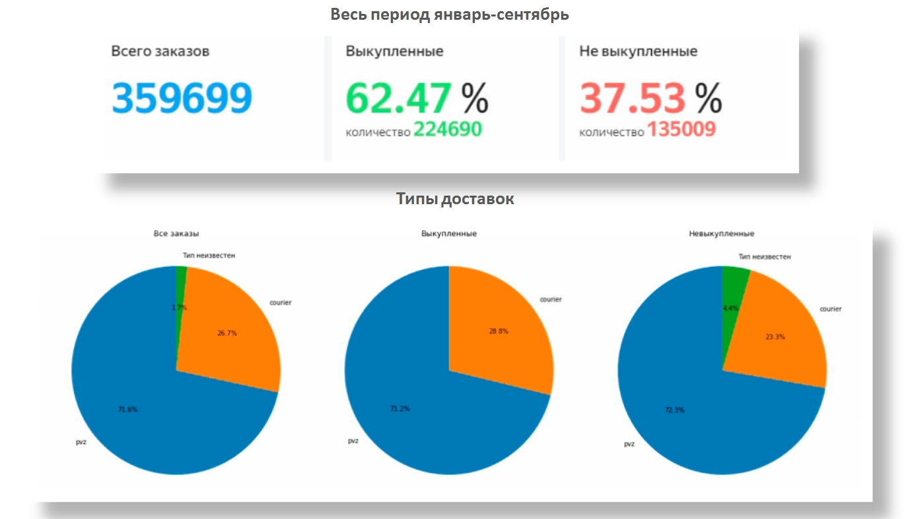
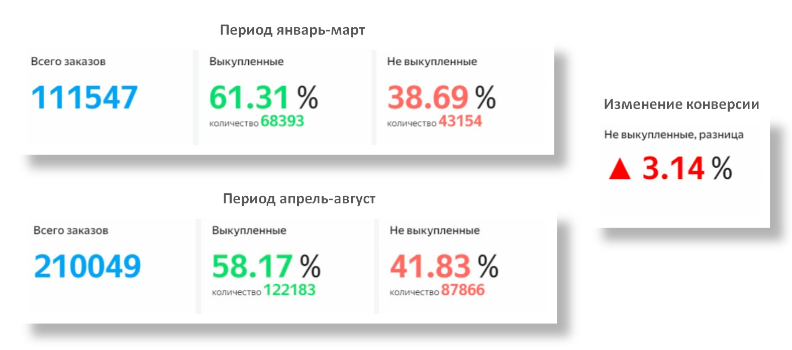
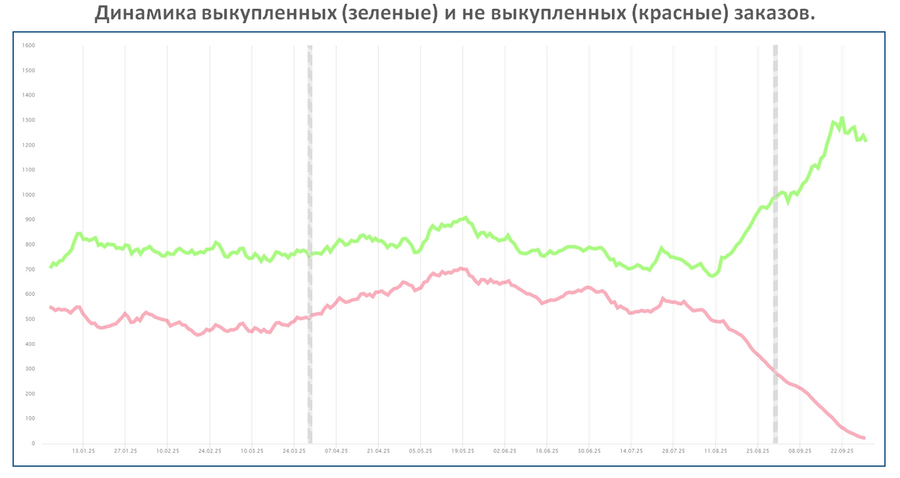
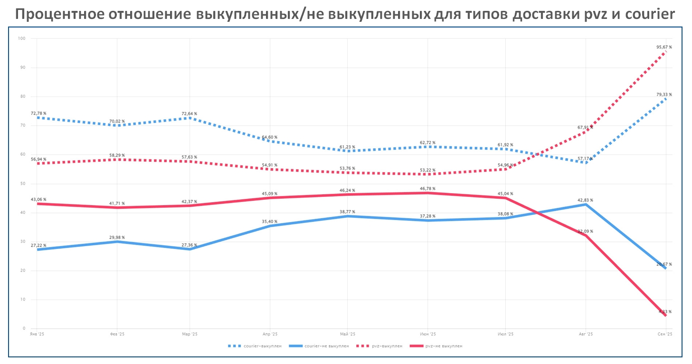
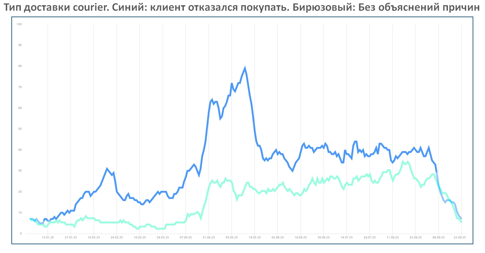
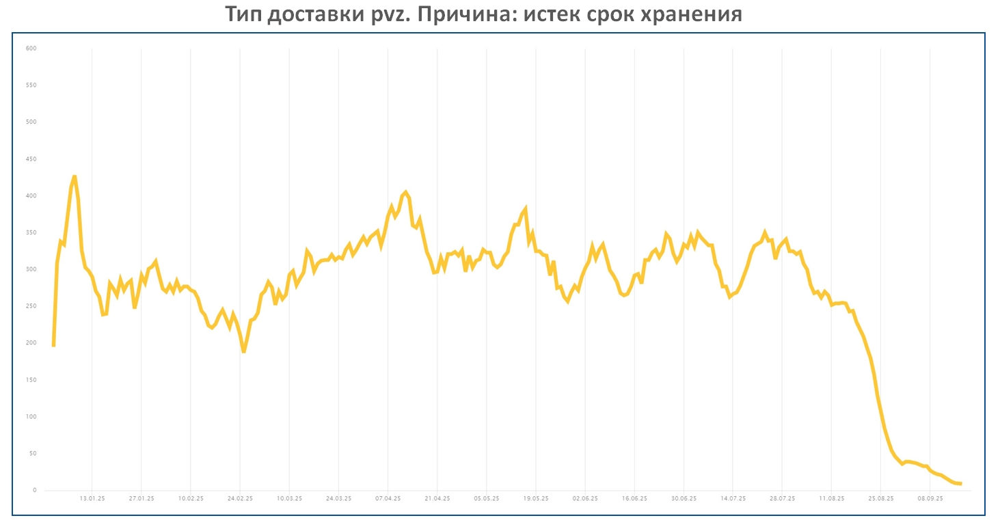
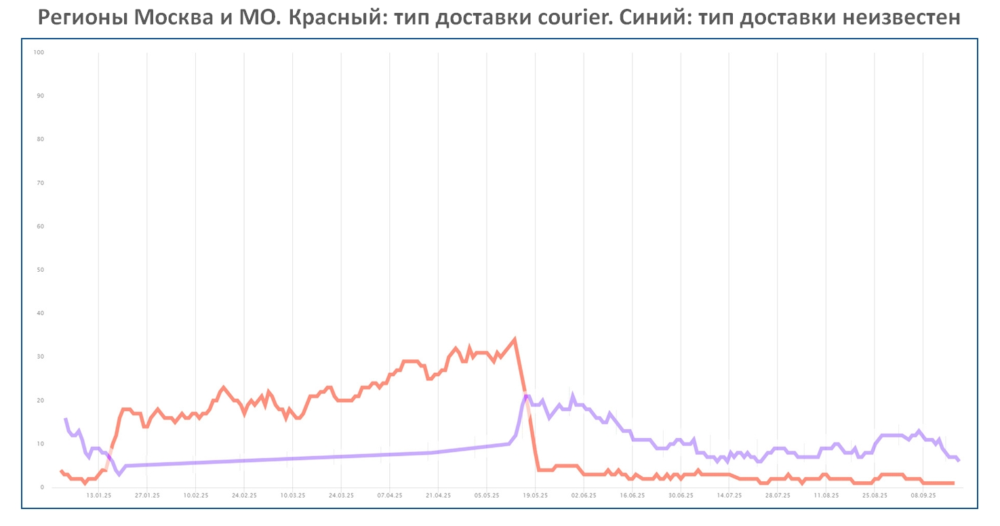
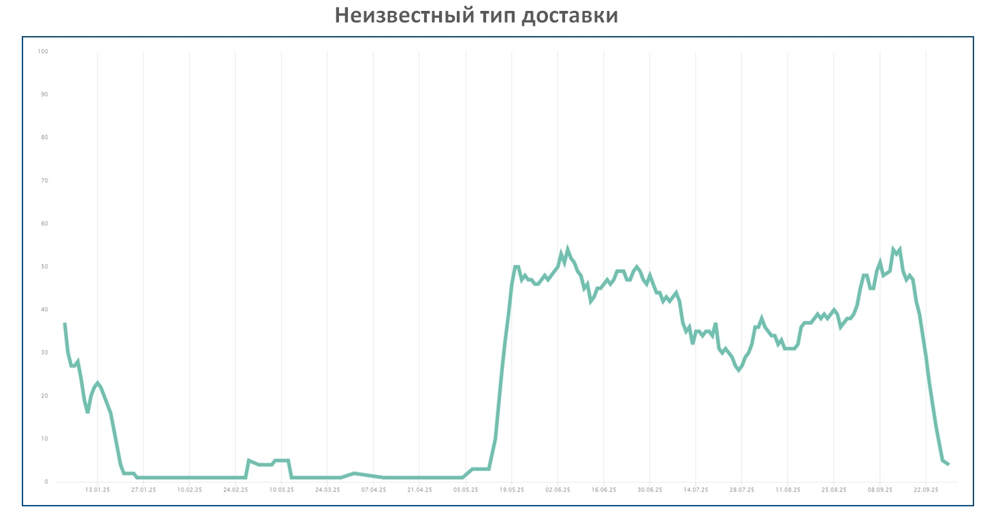

В апреле-августе 2025г. у клиентов e-commerce произошло снижение выкупа заказов. Необходимо проанализировать имеющиеся данные и сделать предположения о возможных причинах, повлиявших на снижение выкупа.

Вам дана выгрузка - история заказов клиента с января по сентябрь 2025г.

Содержание выгрузки:

    id - номер заказа
    created_at - дата создания заказа
    ds_status - статус (выкуплен/не выкуплен)
    type_delivery - тип доставки (ПВЗ, курьер, постамат)
    recipient_region - регион получателя заказа
    recipient_region_number - номер региона получателя заказа
    fail_reason - причина отказа от заказа
    total_cost_for_recipient - цена заказа для покупателя (если цена ниже 300 руб., то значит заказ был предоплачен, если выше, то оплата при получении)

Необходимо:

    Провести анализ причин отказа от заказа (fail_reason)
    Оформить результат анализа любым удобным для вас способом

---

• Всего в датасете находится 359 699 уникальных заказов. Датасет включает в себя период с 2025-01-01 по 2025-09-30. В датасете имеется 4 разных типов доставки: pvz (пункт выдачи), courier (курьер), postomat (постомат) и неизвестный тип (значения None). Тип postomat я исключил из расчетов, т.к. он имеет мизерное количество заказов (меньше 0.001%). Два типа pvz и courier обеспечивают >95% доставок

## • Описание A/B теста:

## • Описание A/B теста:

## • Описание A/B теста:

## • Описание A/B теста:

## • Описание A/B теста:

## • Описание A/B теста:

## • Описание A/B теста:

